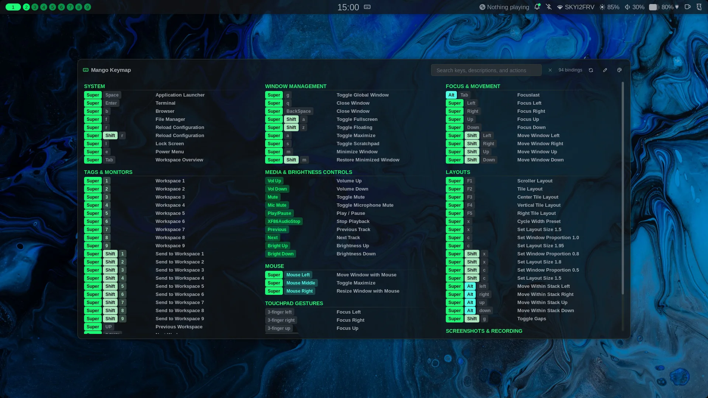
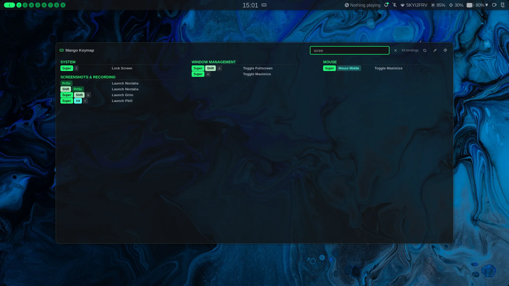
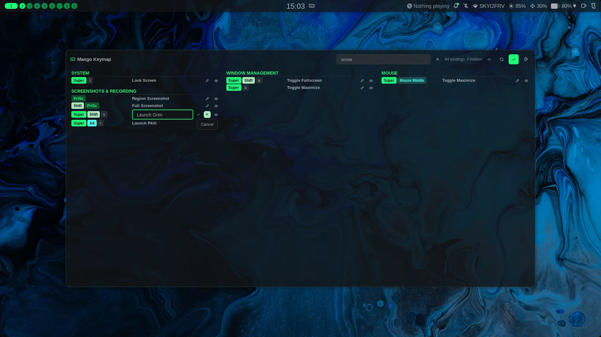
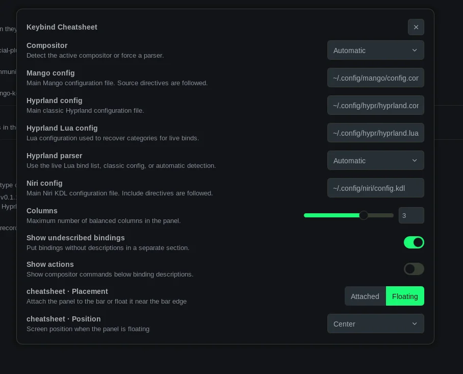

# Noctalia Keybind Cheatsheet

A Noctalia v5 plugin source containing the `kenn/keybind-cheatsheet` plugin.
Its event-driven data service reads Mango, Hyprland, or Niri keybindings once
when Noctalia loads the plugin and whenever a refresh is explicitly requested.
The panel opens from the prepared snapshot without reparsing configuration.

`kenn` is the plugin's fixed publisher namespace, not the local Linux
username. Copy commands containing `kenn/keybind-cheatsheet` unchanged.

For installation, configuration, compositor keybinds, and IPC commands, see
[`keybind-cheatsheet/README.md`](keybind-cheatsheet/README.md).

Hyprland and Niri users can help validate real compositor behavior using the
[`TESTING.md`](TESTING.md) checklist and report any compatibility issues.

## Acknowledgements

Keybind Cheatsheet was inspired by the original
[Keybind Cheatsheet for Noctalia v4](https://github.com/4rmcyt/noctalia-plugins/tree/main/keybind-cheatsheet)
created by [blackbartblues](https://github.com/blackbartblues).

This Noctalia v5 plugin is an independent implementation rather than a direct
port. It has its own user interface, service and cache lifecycle, persistence
model, tests, and integration with the current Noctalia plugin API.

## Screenshots

### Keymap



### Search



### Edit mode



### Settings



## Local development

Add this checkout as a path source, enable the plugin, then add its `keybinds`
widget to a bar:

```sh
noctalia msg plugins source add keybind-dev path "$PWD"
noctalia msg plugins enable kenn/keybind-cheatsheet
```

Luau files hot-reload. Reload Noctalia configuration after changing
`plugin.toml`.
